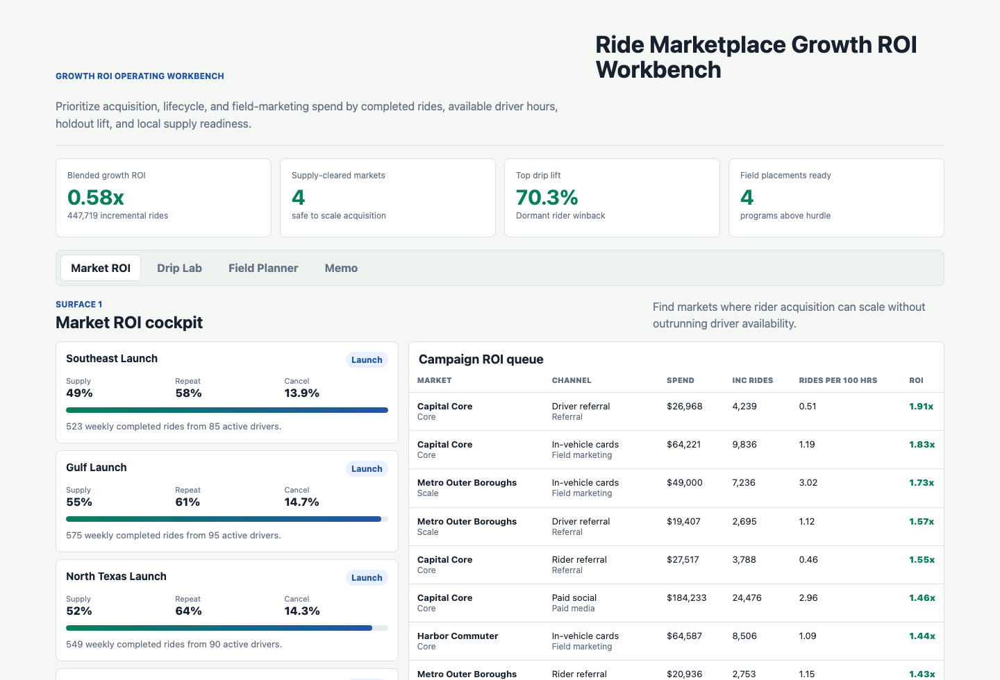
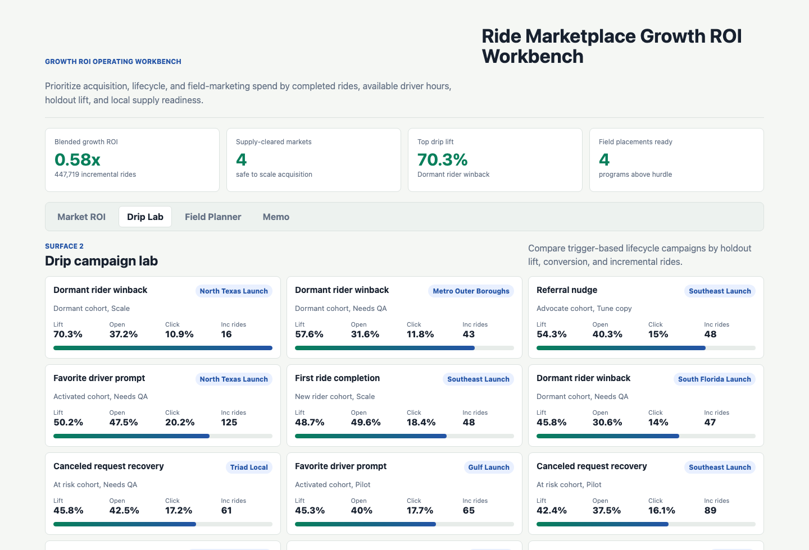
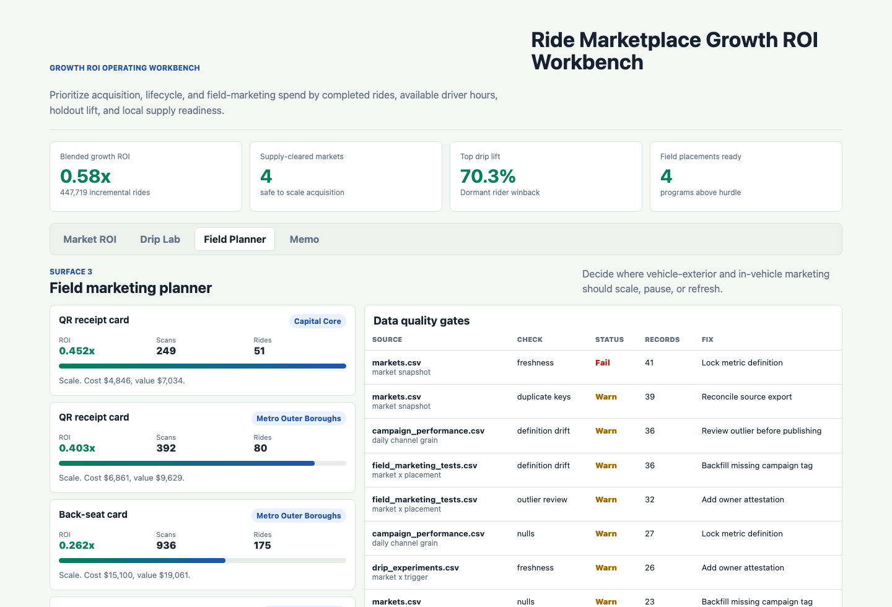

# Ride Marketplace Growth ROI Workbench

Portfolio artifact for a Business Analyst role supporting a peer-to-peer ride marketplace software platform. The workbench shows how a small growth and operations team can decide where to scale rider acquisition, lifecycle drip campaigns, vehicle-exterior advertising, in-vehicle marketing, referrals, organic social, and paid media without wasting spend in markets that lack enough driver supply.

## Portfolio Surface

The artifact is a browser-based operating workbench with four surfaces:

- **Market ROI cockpit:** ranks markets and campaign channels by modeled growth ROI, incremental rides, supply coverage, repeat usage, and incremental rides per 100 available driver hours.
- **Drip campaign lab:** compares trigger-based lifecycle campaigns using open rate, click rate, holdout conversion, lift, and incremental rides.
- **Field marketing planner:** evaluates vehicle-exterior and in-vehicle placements by QR source tags, completed rides, program cost, estimated value, and supply guardrails.
- **Recommendation memo:** converts the analysis into owner-specific next steps for growth analytics, marketplace operations, lifecycle marketing, and field operations.

## Screenshots



**Market ROI cockpit:** identifies markets where paid, organic, referral, lifecycle, and field marketing spend can scale because completed rides and driver-hour coverage support the demand.



**Drip campaign lab:** compares lifecycle triggers by lift against holdout conversion so retention recommendations do not rely only on open rates.



**Field marketing planner:** links vehicle-exterior and in-vehicle placements to QR scans, ride requests, completed rides, ROI, and data quality gates.

## Data Strategy

The project uses synthetic but role-realistic operating data. It is not real company performance data.

The synthetic structure is modeled on public ride marketplace patterns: multi-market expansion, driver-side supply constraints, riders seeking lower fares, trusted or favorite-driver behavior, subscription-style driver economics, referral incentives, paid media, organic social, lifecycle messaging, vehicle-exterior advertising, and in-vehicle placements.

The generator in `scripts/build_growth_artifact.py` uses a fixed random seed and creates:

| Dataset | Grain | Rows | Purpose |
|---|---:|---:|---|
| `data/markets.csv` | Market snapshot | 8 | Supply coverage, repeat usage, demand, trust-request share, and growth-stage segmentation |
| `data/campaign_performance.csv` | Date x market x channel | 8,640 | Acquisition, lifecycle, referral, field, organic, and paid media ROI analysis |
| `data/drip_experiments.csv` | Market x trigger | 40 | Holdout lift, open rate, click rate, conversion, and incremental rides |
| `data/field_marketing_tests.csv` | Market x placement | 40 | Vehicle and in-vehicle program ROI using QR source tags |
| `data/data_quality_checks.csv` | Source table x check | 20 | Freshness, null, duplicate, definition drift, and outlier controls |

Key assumptions:

- Launch markets have lower supply coverage and higher growth indices.
- Core markets have larger ride request volume and stronger repeat usage.
- Campaign ROI is penalized when driver supply coverage is too low to convert rider requests into completed rides.
- Drip campaigns include holdout conversion so lift can be discussed as an experiment-style measure.
- Field marketing value uses estimated downstream ride value rather than only first-ride fare value, which is documented so the scope is clear.

## Role Relevance

This artifact demonstrates the work expected from an entry-level Business Analyst in a fast-moving marketplace environment:

- building and using analytical tools to improve acquisition, retention, engagement, and platform usage
- managing custom dashboards for dynamic marketplace operations
- analyzing drip campaign open rates, conversion, and effectiveness
- evaluating paid media ROI with marketplace guardrails
- turning vehicle-exterior, in-vehicle, referral, and organic social programs into measurable operating decisions
- writing concise recommendations that connect data to action

## How To Run

```bash
python3 -m http.server 4173
```

Then open `http://localhost:4173`.

To regenerate the data and app payload:

```bash
python3 scripts/build_growth_artifact.py
```

## Scope Statement

This project does:

- model the decision logic for a ride marketplace growth team
- expose the source-style CSVs and reproducible generator
- show how acquisition ROI changes when supply coverage is included
- compare lifecycle triggers with holdout lift
- connect field marketing placements to tagged conversion and quality controls

This project does not:

- claim to represent real company performance
- use private marketplace data
- optimize dispatch, pricing, or matching algorithms
- replace a production BI stack or experimentation platform

