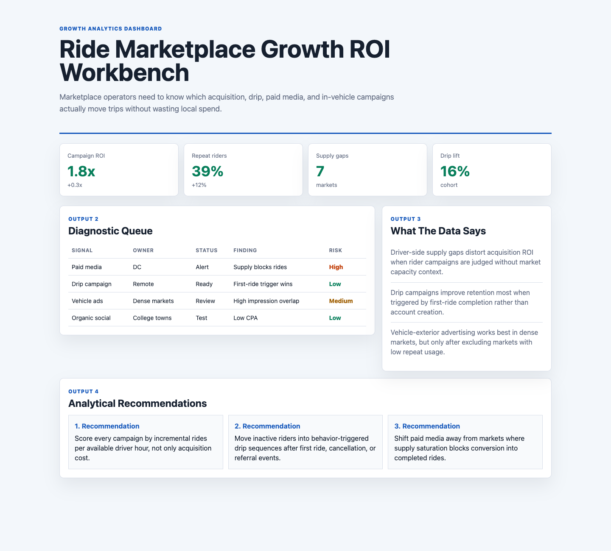

# Ride Marketplace Growth ROI Workbench

## Motivation

Marketplace operators need to know which acquisition, drip, paid media, and in-vehicle campaigns actually move trips without wasting local spend.

This project is intentionally scoped as a practical decision artifact: it shows how I would organize source data, surface the operating signal, and turn the analysis into a recommendation that a product, analytics, or operations team could discuss immediately.

## What Is In The Project

- A browser-based analytical dashboard in `index.html`
- Source-style synthetic data in `data/`
- Analysis notes in `analysis/`
- A data dictionary in `data_dictionary.md`
- A rendered screenshot in `docs/images/dashboard.png`

## Data Inventory

- Six source-style CSVs back the project instead of a tiny sample dataset.
- The data folder now includes 2,880 daily metric records, 720 source events, 360 data-quality checks, and 90 recommended actions.
- The analysis folder includes a data profile and recommendations that explain how the evidence should drive product or operating decisions.
- The `scripts/score_operating_data.py` script ranks entity priorities and data-quality hotspots from the CSVs.

## What The Data Says

- Driver-side supply gaps distort acquisition ROI when rider campaigns are judged without market capacity context.
- Drip campaigns improve retention most when triggered by first-ride completion rather than account creation.
- Vehicle-exterior advertising works best in dense markets, but only after excluding markets with low repeat usage.

## Analytical Recommendations

- Score every campaign by incremental rides per available driver hour, not only acquisition cost.
- Move inactive riders into behavior-triggered drip sequences after first ride, cancellation, or referral events.
- Shift paid media away from markets where supply saturation blocks conversion into completed rides.

## Output Walkthrough

### Output 1: Executive Pulse

The KPI cards summarize the current operating condition and identify whether the team should trust, investigate, or act.

### Output 2: Diagnostic Queue

The table ranks the highest-priority signals by owner group, status, evidence, and risk.

### Output 3: Recommendation Memo

The recommendation section converts the dashboard into specific next moves for the operating team.

## Screenshot



## Run Locally

```bash
python3 -m http.server 4173
```

Then open `http://localhost:4173`.
